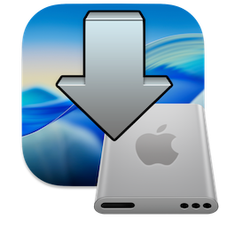

# Drop-EFI for macOS

- Update 10 August 2025 Change AppIcon (Tahoe 26 style)
-----------------------------------------------------------------  
 

Drop-EFI is a (Status Menu Droplet) to mount and Unmount EFI partitions in macOS
- It works from macOS Big Sur 11.5 to macOS Tahoe 26.
- It can mount EFI partitions (GPT)➤ APFS, (GPT)➤ HFS+J, (GPT)➤ NTFS
- Not working encrypted volume

### Credit:
- Build by [chris1111](https://github.com/chris1111/)
- Created from [Script Debugger](https://latenightsw.com/)
- Credit: [Clover team for Mount EFI script](https://sourceforge.net/projects/cloverefiboot/)

### Xcode Build source ➤ [Drop EFI Xcode](https://github.com/chris1111/Drop-EFI/blob/Master/Xcode-Build.md)

### Download ➤ [Release DropEFI](https://github.com/chris1111/Drop-EFI/releases/tag/V1) For macOS Tahoe 26 and lower.

### View Installation Video ⬇︎ Release For macOS Sequoia 15 and macOS Thaoe 26

https://github.com/user-attachments/assets/e23f6337-05d9-450b-b9a5-3ba37df02deb

### View Usage Mount/Unmount EFI Video ⬇︎

https://github.com/user-attachments/assets/6bd7d7e7-a662-4503-b46f-8dd8d6618e1c

